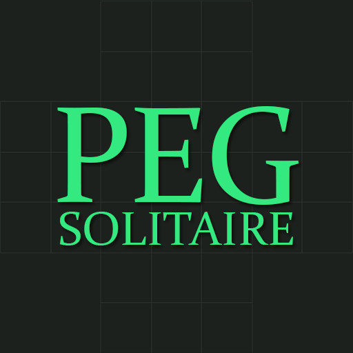
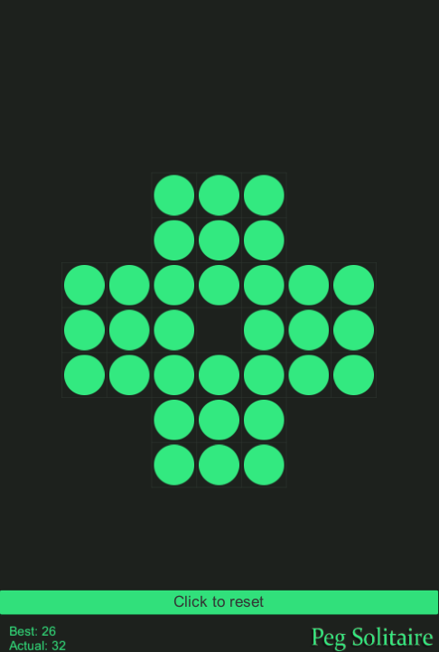
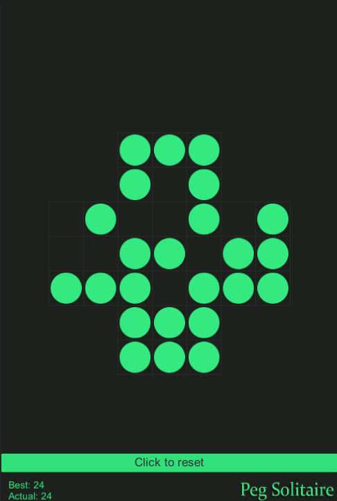
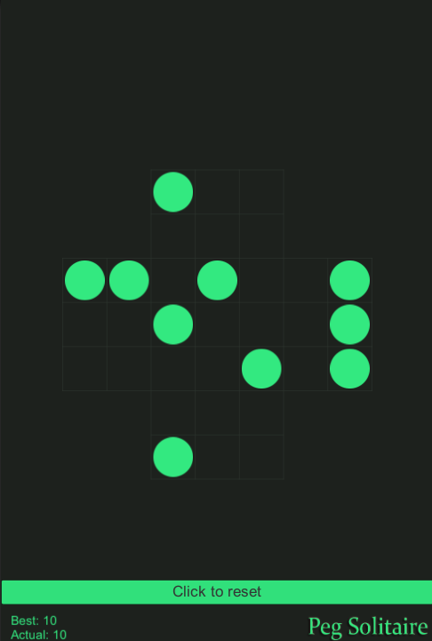

# Peg-Solitaire
<a href="https://en.wikipedia.org/wiki/Peg_solitaire">Peg Solitaire</a> game created with Unity engine. (Unity v. 5.3.4)

<h3> Showcase </h3>

<h3> Notes </h3>
Whole logic of game works on arrays, which specify if pin can move in choosen direction. 
Selection of pins works with Event System. 
